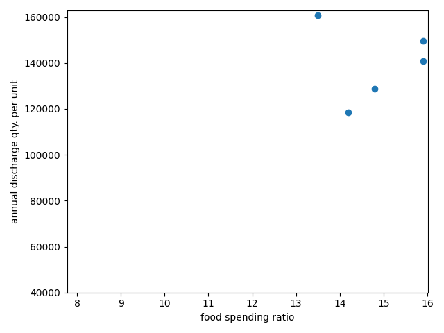

## food-waste
### 1\. 독립변인
- version 1\
\
_식료품&middot;비주류음료에 대한 소비항목별 구성비_

### 2\. 종속변인
* _RFID기반의 음식물쓰레기 세대단위 연 배출량\(365일을 기준으로 했을 때의\)_

### 3\. 제약 사항 및 가정들
- **제약 사항**
  - 2019년 이후 소득 지출 통합 연동표본체계, 조사방법\(가계부\) 등이 개편됨으로써, 2023년까지 직전 5년 동안의 자료들만 분석에 활용할 수 있었다\.
  - 이상적으로는 세대단위 월 배출량을 종속변인으로 설정하고 싶었지만, 계절적인 요인이라든가 기타 특수한 요인들\(명절과 휴가 등\)의 영향을 배제할 수 없었기 때문에 연 배출량으로 분석하게 되었다\.

- **가정한 것들**
  - **공통**
    1. 각 자료에서 가구에 대한 표본과 세대에 대한 표본이 개념적으로 서로 동일한 것으로 가정하였다\.
  - **독립변인에 대한**
    1. 연도별로 표본에 속해 있는 모든 가구의 평균적인 생활수준은 2019년부터 2023년까지 매년 변함없을 것이라고 가정하였다\. **\[version 1 한정\]**
    2. 위의 5년 동안에 해당하는 각 연도의 소비항목별 소비자물가상승률은 모두 동일한 것으로 가정하였다\. **\[version 1 한정\]**
  - **종속변인에 대한**
    1. 한국환경공단에서 제공하는 음식물쓰레기 배출정보 서비스에 포함되어 있는 아파트 세대 수 및 좌표 정보 목록 조회 오퍼레이션\(일련번호 15번\)의 응답 메시지에서 등록일시를 나타내는 regDate 항목의 시점과 해당 아파트에서 음식물쓰레기 수거함이 사용되기 시작한 시점이 서로 동일한 것으로 가정하였다\.

### 4\. 결과

- 위 도표에서 \[식료품&middot;비주류음료에 대한 소비항목별 구성비\]의 단위는 백분율\(_%_\)이고 \[RFID기반의 음식물쓰레기 세대단위 연 배출량\]의 단위는 그램\(_g_\)입니다\.

### 5\. 레퍼런스
- 독립변인인 _식료품&middot;비주류음료에 대한 소비항목별 구성비_
  1. 통계청 지표누리\. **소비지출 비목별 구성비**\. https://www.index.go.kr/unity/potal/indicator/IndexInfo.do?clasCd=10&idxCd=F0146
     - [_spending\_ratio\.xlsx 파일_](spending_ratio.xlsx)

- 종속변인인 _RFID기반의 음식물쓰레기 세대단위 연 배출량_
  1. 한국환경공단\. **음식물쓰레기 배출정보 서비스**\. https://www.data.go.kr/data/3045421/openapi.do
     - RFID기반의 음식물쓰레기 종량제를 이용하는 아파트들 각각의 세대수와 등록일시 항목 쌍을 레코드화한 [_apt\_info\_list\.csv 파일_](apt_info_list.csv)
     - RFID기반의 음식물쓰레기 종합배출내역\(일별\)의 날짜와 배출량 항목 쌍을 레코드화한 [_dis\_date\_and\_quantity\_list\.csv 파일_](dis_date_and_quantity_list.csv)
